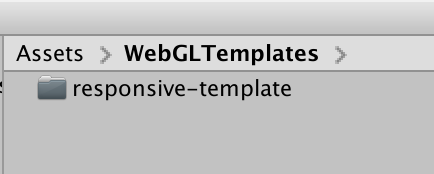
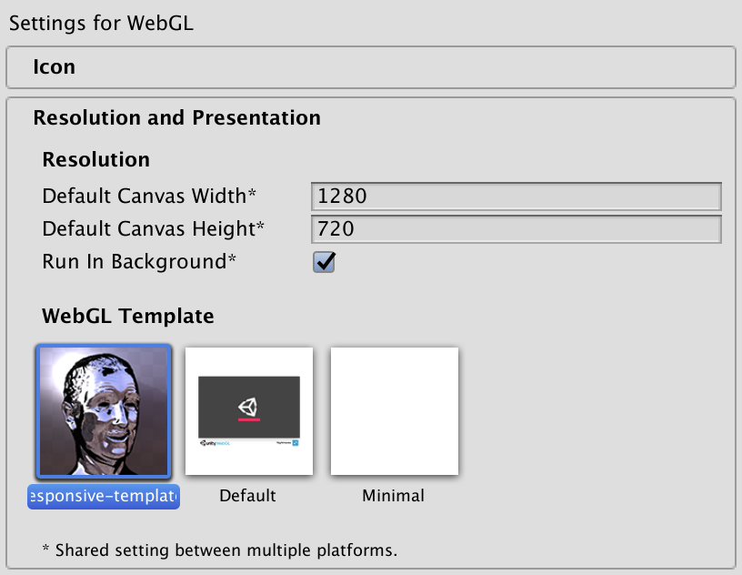

# unity-webgl-responsive

Responsive layout for Unity WebGL applications, intended for websites that have more going on than the application itself.

## How to use

Create a folder called `WebGLTemplates` in the `Assets` folder of your Unity project.

Copy the `responsive-template` folder and all of its contents into `WebGLTemplates`.



Select the template in the Player settings (`Edit > Project Settings` then select the `Player` category) and set the default canvas resolution.



Change the max-width property of `.webgl-wrapper` in `style.css` to set the application's maximum width:

```
.webgl-wrapper {
  width: 100%;
  max-width: 1280px;
}
```

## Notes

- The application canvas is dynamically resized based on the current width of the `.webgl-wrapper` div.
- Press F to toggle fullscreen.
